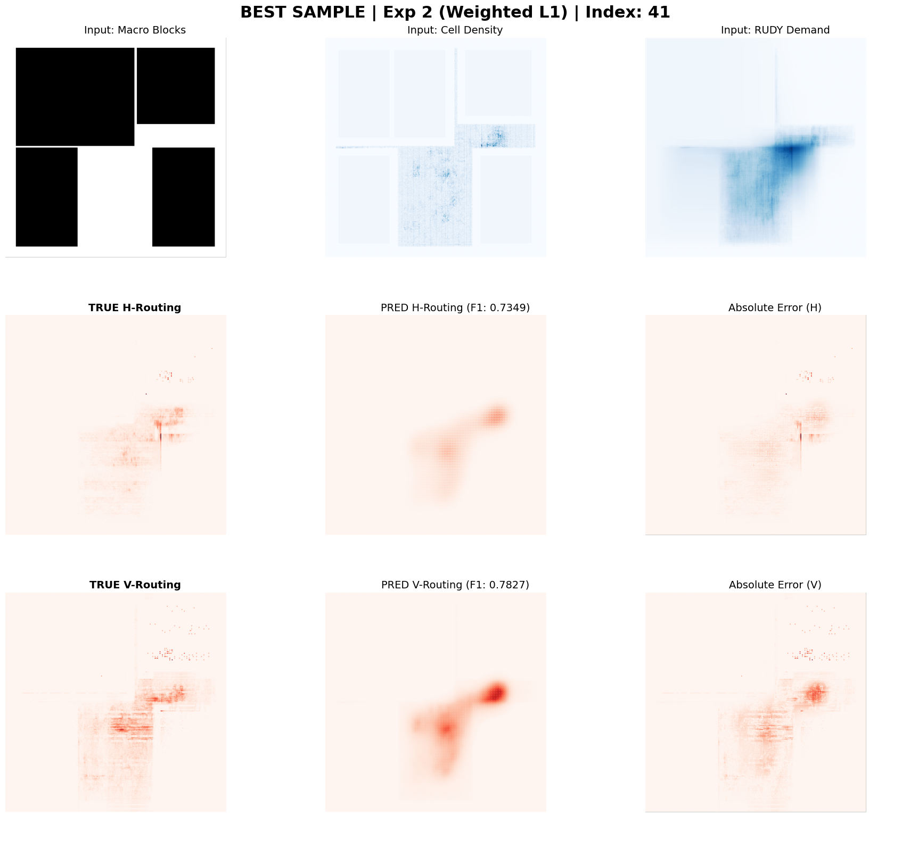
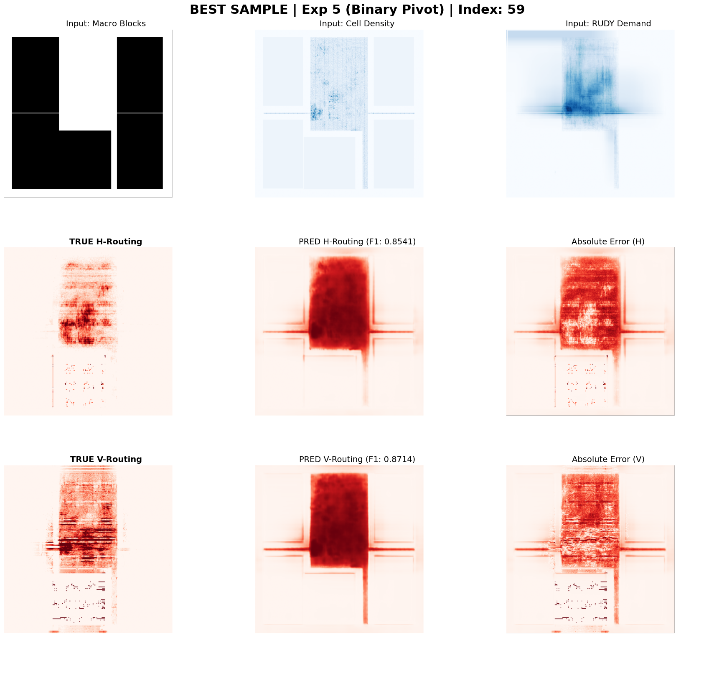

# Evaluation Metrics and Results Analysis

This document provides a comprehensive breakdown of the evaluation results for all experiments conducted in this ablation study on the completely unseen test set. The primary objective was to detect routing congestion overflows, analyzing the tension between predicting the general structural shape of routing demand and accurately identifying critical, sparse hotspots.

## The SSIM vs. F1 Trade-off

The most significant finding of this study is the inherent mathematical trade-off between structural similarity (SSIM) and hotspot detection sensitivity (F1-Score). Predicting the exact shape of routing utilization across an entire chip requires a different optimization landscape than detecting isolated, extreme anomalies.

This trade-off is visually evident when comparing the best predictions from the regression-focused and classification-focused models.

*Figure 1: Experiment 2 (Weighted L1) Prediction. The model accurately draws the structural layout of the routing demand, resulting in an exceptionally high SSIM (>0.92). However, it smooths over the extreme peaks, failing to trigger alarms for actual routing failures.*

*Figure 2: Experiment 5 (Binary Pivot) Prediction. By shifting to a weighted classification task, the structural beauty of the prediction degrades (SSIM drops below 0.50), but the model successfully highlights the critical, disjointed hotspot regions (highest F1-Score).*

---

## Comprehensive Test Set Results

Below are the full arrays of metrics for each experiment evaluated on the blind test shards.
* **Regression Metrics:** Root Mean Squared Error (RMSE), Mean Absolute Error (MAE), Pearson Correlation Coefficient (PCC).
* **Structural Metrics:** Structural Similarity Index Measure (SSIM).
* **Classification Metrics (Threshold > 0.1):** ROC-AUC, Precision-Recall AUC (PR-AUC), F1-Score, Matthews Correlation Coefficient (MCC).

### Experiment 1: Baseline U-Net (MSE)
The baseline experiment established the initial metrics using a standard U-Net optimized with Mean Squared Error. 

| Metric | Horizontal (H) Routing | Vertical (V) Routing |
| :--- | :---: | :---: |
| **RMSE** | 0.0751 | 0.1224 |
| **MAE** | 0.0082 | 0.0197 |
| **PCC** | 0.2156 | 0.2963 |
| **SSIM** | 0.7580 | 0.7880 |
| **ROC-AUC** | 0.8922 | 0.9148 |
| **PR-AUC** | 0.3817 | 0.4198 |
| **F1-Score** | 0.3208 | 0.3142 |
| **MCC** | 0.3877 | 0.3534 |

**Observation:** The model achieved acceptable structural similarity but failed to identify the peak overflow regions. MSE penalizes all errors quadratically, forcing the network to predict the global mean of the sparse data rather than the extreme spikes associated with actual DRC violations.

---

### Experiment 2: U-Net + Weighted L1
This experiment introduced a weighted multiplier to the L1 loss to force the network to respect high-congestion zones.

| Metric | Horizontal (H) Routing | Vertical (V) Routing |
| :--- | :---: | :---: |
| **RMSE** | 0.0758 | 0.1247 |
| **MAE** | 0.0038 | 0.0148 |
| **PCC** | 0.1573 | 0.2371 |
| **SSIM** | 0.9690 | 0.9219 |
| **ROC-AUC** | 0.7570 | 0.8818 |
| **PR-AUC** | 0.2774 | 0.3782 |
| **F1-Score** | 0.2837 | 0.2316 |
| **MCC** | 0.3376 | 0.2900 |

**Observation:** The spatial weighting drastically improved the network's ability to recreate the physical layout of the routing demand, achieving the highest SSIM of the entire study. However, the absolute peak prediction values remained too low to cross the threshold of an actual overflow, causing the F1-Score to drop below the baseline.

---

### Experiment 3: Decoupled U-Net (Huber)
This architectural shift physically separated the final convolutional layers for horizontal and vertical predictions to prevent channel bleed.

| Metric | Horizontal (H) Routing | Vertical (V) Routing |
| :--- | :---: | :---: |
| **RMSE** | 0.0749 | 0.1219 |
| **MAE** | 0.0078 | 0.0190 |
| **PCC** | 0.2090 | 0.3019 |
| **SSIM** | 0.7927 | 0.8236 |
| **ROC-AUC** | 0.8958 | 0.9164 |
| **PR-AUC** | 0.3737 | 0.4049 |
| **F1-Score** | 0.3828 | 0.3890 |
| **MCC** | 0.4252 | 0.3719 |

**Observation:** Decoupling the output heads allowed the network to learn independent routing capacities for different metal layers. This resulted in an immediate and balanced improvement in F1-Scores and MCC for both directions. The Huber loss provided necessary stability against noisy labels.

---

### Experiment 4: Attention U-Net (CBAM)
Convolutional Block Attention Modules were added to the decoupled architecture to apply spatial and channel-wise filtering.

| Metric | Horizontal (H) Routing | Vertical (V) Routing |
| :--- | :---: | :---: |
| **RMSE** | 0.0742 | 0.1219 |
| **MAE** | 0.0112 | 0.0250 |
| **PCC** | 0.2560 | 0.3138 |
| **SSIM** | 0.6845 | 0.7280 |
| **ROC-AUC** | 0.9313 | 0.9255 |
| **PR-AUC** | 0.3988 | 0.4188 |
| **F1-Score** | 0.3998 | 0.4154 |
| **MCC** | 0.4072 | 0.3909 |

**Observation:** The spatial attention mechanism successfully forced the network to focus entirely on dense logic clusters. This localized focus pushed the ROC-AUC scores higher, demonstrating that the model was effectively ranking hotspot probabilities.

---

### Experiment 5: Decoupled (Binary Pivot)
The fundamental machine learning task was shifted from continuous regression to imbalanced binary classification using Masked Weighted BCE.

| Metric | Horizontal (H) Routing | Vertical (V) Routing |
| :--- | :---: | :---: |
| **RMSE** | 0.1070 | 0.1555 |
| **MAE** | 0.0294 | 0.0512 |
| **PCC** | 0.2489 | 0.2989 |
| **SSIM** | 0.4105 | 0.4771 |
| **ROC-AUC** | 0.9668 | 0.9329 |
| **PR-AUC** | 0.4647 | 0.4439 |
| **F1-Score** | 0.4641 | 0.3885 |
| **MCC** | 0.4617 | 0.3914 |

**Observation:** By abandoning the attempt to predict exact missing track counts, the optimizer was freed to act purely as a hotspot detector. The asymmetric weighting within the BCE loss aggressively penalized false negatives. This pivot caused RMSE to rise and SSIM to collapse, but yielded massive gains in F1-Score, PR-AUC, and ROC-AUC.

---

### Experiment 6: Inception U-Net (BCE)
The final experiment, executed after consolidating the metrics from the first five experiments, combined the binary classification strategy with a multi-scale Inception architecture.

| Metric | Horizontal (H) Routing | Vertical (V) Routing |
| :--- | :---: | :---: |
| **RMSE** | 0.0994 | 0.1762 |
| **MAE** | 0.0287 | 0.0749 |
| **PCC** | 0.5517 | 0.5278 |
| **SSIM** | 0.4434 | 0.3787 |
| **ROC-AUC** | 0.9750 | 0.9409 |
| **PR-AUC** | 0.5417 | 0.4876 |
| **F1-Score** | 0.5028 | 0.4351 |
| **MCC** | 0.5041 | 0.4274 |

**Observation:** The inclusion of parallel 1x1, 3x3, and 5x5 convolutions allowed the network to analyze local pin density and global routing corridors simultaneously. This architecture proved to be the most capable at distinguishing between safe high-density regions and actual routing failures, achieving the definitive best hotspot detection metrics (F1, PR-AUC, ROC-AUC) of the study.

---

## Conclusion: The Limits of Grid-Based 2D Prediction

While the progression from Exp 1 to Exp 6 demonstrates significant improvements in hotspot detection, the plateauing F1-Scores highlight a fundamental limitation in the dataset representation itself. 

Treating VLSI routing congestion as a 2D image-to-image translation task introduces physical blind spots:

1. **Dimensionality Loss:** Modern chip routing occurs in three dimensions across multiple interconnected metal layers (e.g., M1 through M7). Collapsing these distinct layers into a flattened 2D grid fundamentally destroys capacity and directionality information. Vertical vias, which are frequent sources of severe congestion, cannot be accurately represented in a purely horizontal/vertical 2D matrix. 
2. **Quantization Errors:** The quantization required to fit macro placements and standard cells into a uniform GCell grid forces a loss of sub-GCell resolution. Minor pin misalignments that cause localized DRC violations are smoothed away during the rasterization process.

To surpass the performance ceiling observed in Experiment 6, future methodologies must likely abandon 2D grids in favor of Graph Neural Networks (GNNs), which can natively represent the 3D topological relationships of standard cells, nets, and metal layers without spatial quantization loss.
