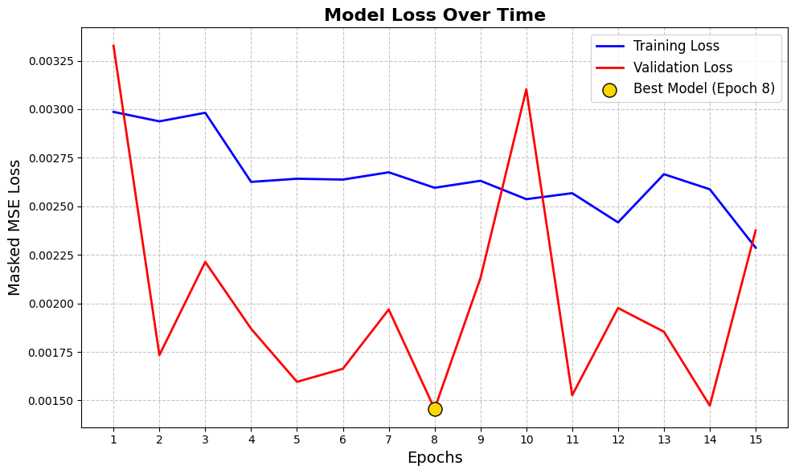
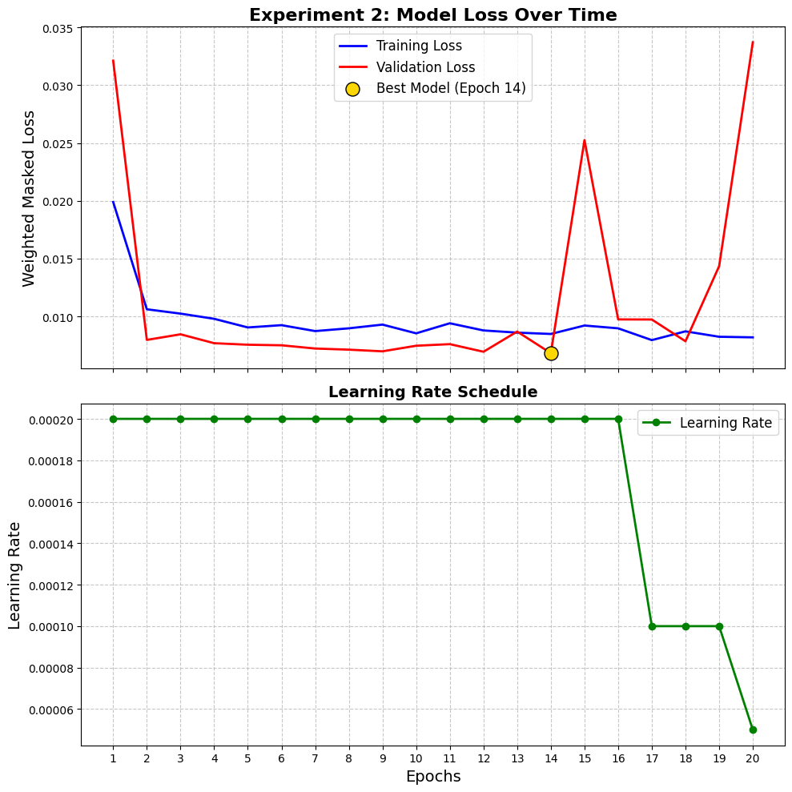
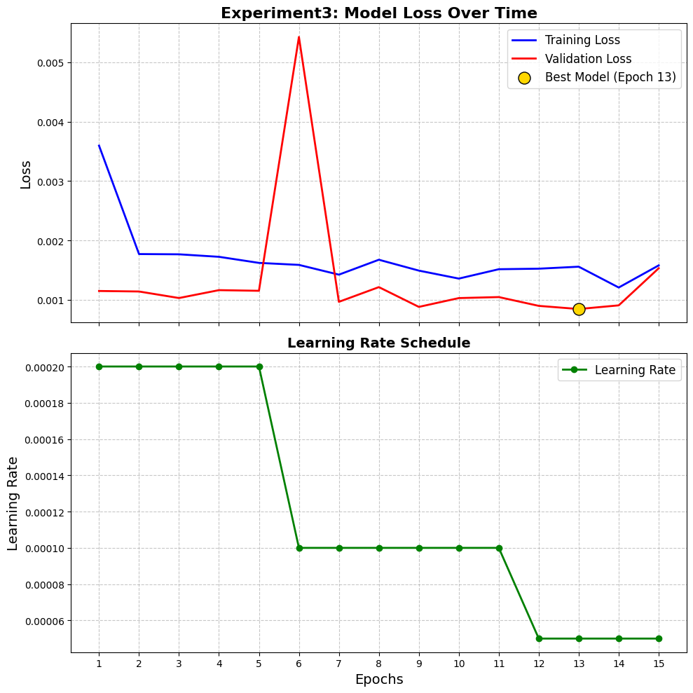
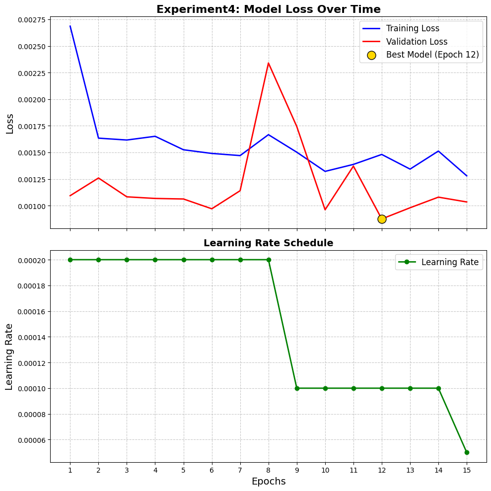
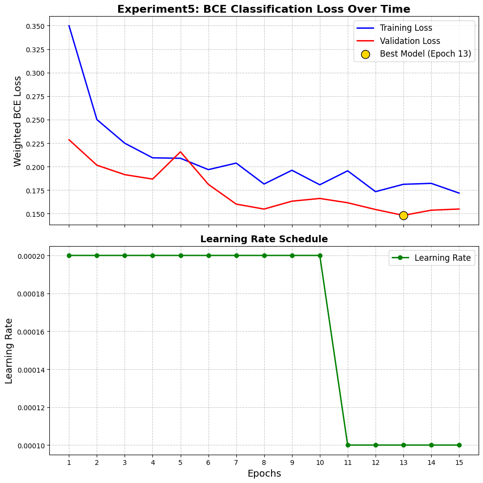
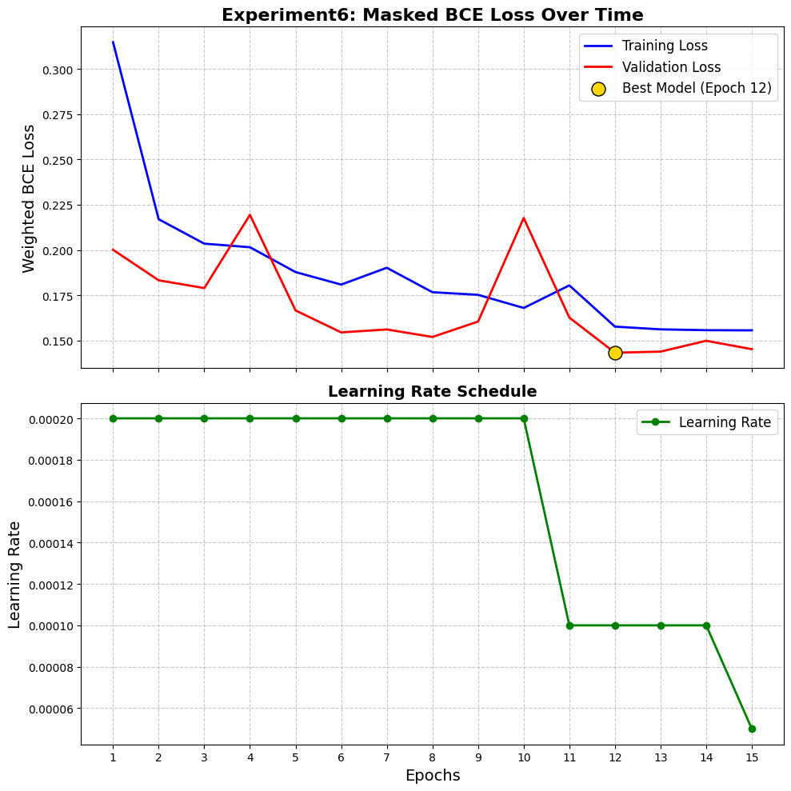

# Training Strategy and Loss Functions

This document details the mathematical formulation of the loss functions and the training dynamics utilized across the ablation study. Because VLSI routing congestion is an extremely sparse problem—where the vast majority of a chip routes successfully and failures are highly localized—standard loss functions often optimize for the empty space, ignoring critical bottlenecks.

All mathematical loss definitions are centralized in `core/loss.py`, and the standardized training loop is maintained in `utils/trainer.py`.

## The Masking Protocol

Before examining individual loss functions, it is critical to understand the masking protocol applied to all calculations. 

Because the raw chip designs vary in dimensions, they were zero-padded to a uniform 320x320 grid. To ensure the network is not penalized for predictions in these artificial zero-padded regions, a binary mask (where 1 indicates valid chip area and 0 indicates padding) is passed into every loss function. The raw computed loss is multiplied by this mask tensor before the mean reduction is applied. This strictly confines the gradient updates to the physical silicon area.

---

## Experiment-by-Experiment Training Dynamics

To enforce a standardized evaluation protocol, all experiments were restricted to a maximum of 15 epochs. Grid-based spatial data mapped to dense pre-placement features converges rapidly. Training beyond 15 epochs yielded negligible validation improvements and introduced the risk of overfitting to the specific macro placements of the training set. 

A `ReduceLROnPlateau` scheduler (factor=0.5, patience=2) was utilized to dynamically decay the learning rate when validation loss stagnated. 

### Experiment 1: Baseline U-Net (MSE)

**Loss Function:** Mean Squared Error (MSE)
**Objective:** Establish a continuous regression baseline.

MSE penalizes large errors heavily. However, because extreme congestion spikes are rare, the model acted conservatively, smoothing out predictions to minimize the average error across the entire chip. This resulted in a high structural similarity (SSIM) but a poor ability to detect actual routing failures (low F1-Score).

*Figure 1: Exp 1 Training and Validation Loss. The curves demonstrate rapid initial convergence, stabilizing by epoch 8, validating the 15-epoch limit.*

### Experiment 2: U-Net (Weighted L1)

**Loss Function:** Masked Weighted L1 Loss
**Objective:** Force the network to prioritize high-congestion zones while maintaining structural sharpness.

L1 loss is less prone to over-smoothing than MSE. To address sparsity, a spatial multiplier (weight factor of 2.0) was applied specifically to pixels where the ground truth congestion exceeded a 0.1 threshold. This mathematically forced the optimizer to care more about the hotspot regions.

*Figure 2: Exp 2 Loss and Learning Rate. The addition of the learning rate plot shows the scheduler successfully stepping down the learning rate as the validation loss plateaus around epoch 10.*

### Experiment 3: Decoupled U-Net (Masked Huber)

**Loss Function:** Masked Huber Loss
**Objective:** Balance the sharpness of L1 with the stability of MSE against outlier labels.

Global routing estimates contain inherently noisy outlier labels. Huber loss acts as L1 loss for large errors and MSE for small errors, providing a robust mathematical middle-ground. This was paired with the decoupled architecture to isolate horizontal and vertical predictions.

*Figure 3: Exp 3 Loss and Learning Rate. The decoupling of the output heads introduces a smoother loss trajectory, with the scheduler triggering fine-tuning adjustments in the later epochs.*

### Experiment 4: Attention U-Net (CBAM)

**Loss Function:** Masked Huber Loss
**Objective:** Maintain regression stability while the architecture applies spatial filtering.

The loss function was kept consistent with Experiment 3 to properly isolate the effect of adding the Convolutional Block Attention Module (CBAM). 

*Figure 4: Exp 4 Loss and Learning Rate. The integration of attention layers occasionally introduces slight initial volatility, but the learning rate step-downs successfully force the network into a stable local minimum.*

### Experiment 5: Decoupled U-Net (Binary Pivot)

**Loss Function:** Masked Weighted Binary Cross-Entropy (BCE)
**Objective:** Shift the paradigm from continuous regression to imbalanced anomaly detection.

Predicting the exact decimal value of a missing track proved mathematically hostile. The task was pivoted to binary classification: 1 (Overflow/Failure) and 0 (Safe). The BCE loss utilized a `pos_weight` parameter to aggressively penalize false negatives (missed hotspots). Because vertical routing failures were statistically more common than horizontal ones in the dataset, asymmetric weights were applied (e.g., `h_weight=5.0`, `v_weight=2.0`).

*Figure 5: Exp 5 Loss and Learning Rate. Note the change in the loss scale due to the transition from Huber to BCE. The validation loss clearly plateaus, confirming that the model extracts all available classification signal within the 15-epoch constraint.*

### Experiment 6: Inception U-Net (BCE)

**Loss Function:** Masked Weighted Binary Cross-Entropy (BCE)
**Objective:** Optimize the multi-scale architecture for hotspot classification.

The final flagship architecture combined the optimized weighted BCE loss with the multi-scale feature extraction of the Inception modules. 

*Figure 6: Exp 6 Loss and Learning Rate. The complex multi-scale kernels of the Inception layers require careful fine-tuning. The learning rate scheduler's interventions in the final epochs ensure the kernels settle precisely, resulting in the highest hotspot detection metrics of the study.*
